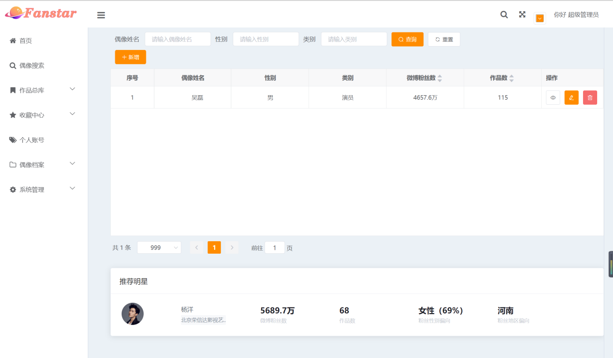
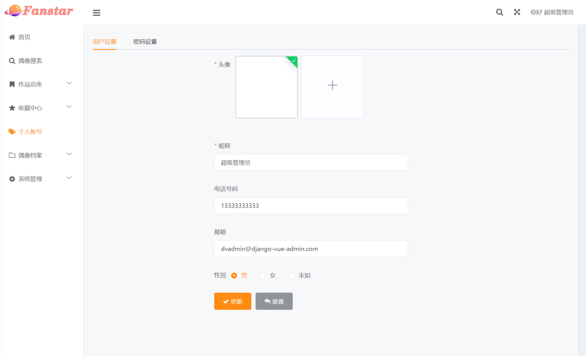

<h1 align="center" style="margin: 30px 0 30px; font-weight: bold;">Fanstar追星服务平台 v1.0</h1>
<h4 align="center">基于 Vue+Django 的管理平台</h4>

## 平台简介

Fanstar追星服务平台，前端采用vue框架，后端采用django框架，实现一个个人idol的管理网站，进行偶像信息的管理。项目授权软件著作权1项。

平台目前已经实现登录、首页推荐、偶像搜索、作品总库、偶像档案、收藏中心、个人账号等功能模块。

* 前端框架框架基于[vue](https://cn.vuejs.org/guide/introduction.html)。
* 前端组件采用[element-ui](https://www.uihtm.com/element/#/zh-CN)，全端兼容的高性能UI框架。
* 后端采用django
* [Echarts](https://echarts.apache.org/zh/index.html)展示多种多种图表。

## 系统架构
偶像档案管理系统架构分为服务层、应用层和感知层三个层次。

感知层位于架构的最底层，关键技术是网络爬虫技术，从新浪微博、豆瓣、城市明星网获取数据；
应用层包括使用Docker等技术的部署运维模块，依托于Numpy、TensorFlow等科学计算库和深度学习框架的计算引擎模块，涵盖数据处理、存储等功能的后端服务模块；
直接和用户进行交互的服务层提供了首页推荐、偶像搜索、作品总库、偶像档案、收藏中心、个人账号六大模块。

## 功能模块

#### 偶像搜索
* 查询：按关键字（可多个）检索，（关键字如：类别、年龄、作品数、粉丝数等）
* 排序：按自定义关键字（可多个）排序，（关键字如：年龄、作品数、粉丝数等）
* 管理员还可以通过增、删、改操作对各个信息进行管理

#### 作品总库总览
* 影视集
  1. 查询：按关键字（可多个）检索，（关键字如：年份、评分、主演等）
  2. 排序：按自定义关键字（可多个）排序，（关键字如：年份、评分、主演等）
  3. 管理员还可以进行增、删、改操作 (增、删、改影视作品信息）
* 唱片集
  1. 查询：按关键字（可多个）检索，（关键字如年份、评分、主演等）
  2. 排序：按自定义关键字（可多个）排序，（关键字如年份、评分、主演等）
  3. 管理员还可以进行增、删、改操作 (增、删、改唱片作品信息）
* 综艺集
  1. 查询：按关键字（可多个）检索，（关键字如年份、评分、主演等）
  2. 排序：按自定义关键字（可多个）排序，（关键字如年份，评分，主演等）
  3. 管理员还可以进行增、删、改操作 (增、删、改综艺作品信息）

#### 偶像档案总览
* 偶像简介展示：偶像照片，基本信息：姓名、公司、职业...... 
* 个人作品集展示：影视集、唱片集、综艺集 (表格形式，可以查询、排序）
* 作品分析：
  1. 作品趋势图（平滑折线图）：根据不同年份的作品数得出偶像热度/活跃度
  2. 作品质量分析：根据作品的豆瓣评分划分等级，不同等级作品的占比情况 
  3. 作品类型分析：影视作品、综艺节目、音乐作品的占比情况（若是对于歌手，音乐作品：按照不同流派的唱片作品的占比分布）
  4. 代表作品展示：展示5部评分最高的代表作品
  5. 近期作品：展示5部近期作品
* 粉丝画像：
  1. 性别分布图展示
  2. 地域分布图展示
  3. 活跃粉丝占比展示
  4. 粉丝类型分布图展示（对用户粉丝量以0、100、500、1000、10000、100000为分隔点，将其划分为五种类型的用户：小透明、常驻博主、资深博主、微博红人、微博大V）
#### 收藏中心
* 偶像列表：已关注的偶像列表；推荐的其他偶像
* 作品列表：已收藏的作品列表；推荐的相关作品
#### 账号管理
* 更改头像
* 更改个人信息（用户名昵称、电话号码、邮箱等）
* 更改密码 

## 演示图

<table>
    <tr>
        <td>登录首页</td>
        <td>
            
            
&nbsp;&nbsp;&nbsp;&nbsp;&nbsp;&nbsp;&nbsp;&nbsp;&nbsp;&nbsp;&nbsp;&nbsp;&nbsp;&nbsp;&nbsp;&nbsp;&nbsp;&nbsp;登录界面

        </td>
        <td>
            
            
&nbsp;&nbsp;&nbsp;&nbsp;&nbsp;&nbsp;&nbsp;&nbsp;&nbsp;&nbsp;&nbsp;&nbsp;&nbsp;&nbsp;&nbsp;&nbsp;&nbsp;&nbsp;首页推荐

        </td>
    <tr>
     <tr>
        <td>偶像搜索</td>
        <td>
            
            
&nbsp;&nbsp;&nbsp;&nbsp;&nbsp;&nbsp;&nbsp;&nbsp;&nbsp;&nbsp;&nbsp;&nbsp;&nbsp;&nbsp;&nbsp;&nbsp;&nbsp;&nbsp;搜索引擎

        </td>
        <td>
            
            
&nbsp;&nbsp;&nbsp;&nbsp;&nbsp;&nbsp;&nbsp;&nbsp;&nbsp;&nbsp;&nbsp;&nbsp;&nbsp;&nbsp;&nbsp;&nbsp;&nbsp;&nbsp;偶像列表

        </td>
    </tr>
    <tr>
        <td>作品总库</td>
        <td>
            
            
&nbsp;&nbsp;&nbsp;&nbsp;&nbsp;&nbsp;&nbsp;&nbsp;&nbsp;&nbsp;&nbsp;&nbsp;&nbsp;&nbsp;&nbsp;&nbsp;&nbsp;&nbsp;影视集

        </td>
        <td>
            
            
&nbsp;&nbsp;&nbsp;&nbsp;&nbsp;&nbsp;&nbsp;&nbsp;&nbsp;&nbsp;&nbsp;&nbsp;&nbsp;&nbsp;&nbsp;&nbsp;&nbsp;&nbsp;音乐集

        </td>
    </tr>
     <tr>
        <td>作品总库</td>
        <td>
            
            
&nbsp;&nbsp;&nbsp;&nbsp;&nbsp;&nbsp;&nbsp;&nbsp;&nbsp;&nbsp;&nbsp;&nbsp;&nbsp;&nbsp;&nbsp;&nbsp;&nbsp;&nbsp;综艺集

        </td>
    </tr>
     <tr>
        <td>偶像档案</td>
        <td>
            
            
&nbsp;&nbsp;&nbsp;&nbsp;&nbsp;&nbsp;&nbsp;&nbsp;&nbsp;&nbsp;&nbsp;&nbsp;&nbsp;&nbsp;&nbsp;&nbsp;&nbsp;&nbsp;作品分析

        </td>
        <td>
            
            
&nbsp;&nbsp;&nbsp;&nbsp;&nbsp;&nbsp;&nbsp;&nbsp;&nbsp;&nbsp;&nbsp;&nbsp;&nbsp;&nbsp;&nbsp;&nbsp;&nbsp;&nbsp;个人作品集

        </td>
    </tr>
    <tr>
        <td>偶像档案</td>
         <td>
            
            
&nbsp;&nbsp;&nbsp;&nbsp;&nbsp;&nbsp;&nbsp;&nbsp;&nbsp;&nbsp;&nbsp;&nbsp;&nbsp;&nbsp;&nbsp;&nbsp;&nbsp;&nbsp;粉丝画像

        </td>
        <td>
            
            
&nbsp;&nbsp;&nbsp;&nbsp;&nbsp;&nbsp;&nbsp;&nbsp;&nbsp;&nbsp;&nbsp;&nbsp;&nbsp;&nbsp;&nbsp;&nbsp;&nbsp;&nbsp;粉丝画像

        </td>
    </tr>
    <tr>
        <td>收藏中心</td>
        <td>
            
            
&nbsp;&nbsp;&nbsp;&nbsp;&nbsp;&nbsp;&nbsp;&nbsp;&nbsp;&nbsp;&nbsp;&nbsp;&nbsp;&nbsp;&nbsp;&nbsp;&nbsp;&nbsp;实时监控

        </td>
    </tr>
    <tr>
        <td>个人信息</td>
        <td>
            
            
&nbsp;&nbsp;&nbsp;&nbsp;&nbsp;&nbsp;&nbsp;&nbsp;&nbsp;&nbsp;&nbsp;&nbsp;&nbsp;&nbsp;&nbsp;&nbsp;&nbsp;&nbsp;告警列表

        </td>
        <td>
            
            
&nbsp;&nbsp;&nbsp;&nbsp;&nbsp;&nbsp;&nbsp;&nbsp;&nbsp;&nbsp;&nbsp;&nbsp;&nbsp;&nbsp;&nbsp;&nbsp;&nbsp;&nbsp;详情面板

        </td>
    </tr>
</table>

## 开发
    # 克隆项目
    git clone https://github.com/QJC1123/idol-dvadmin

    # 进入项目目录
    cd idol-dvadmin

    # 安装依赖
    npm install

    # 启动服务
    npm run dev

